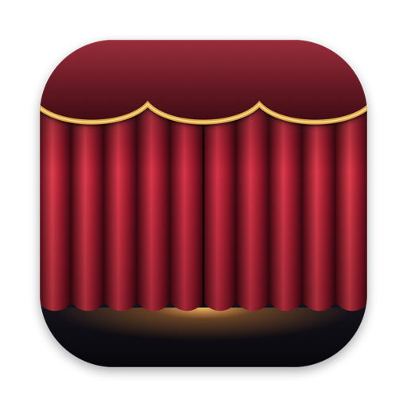

# Curtain

[](https://github.com/laldinsoft/curtain/actions/workflows/ci.yml)
[](LICENSE)




A tiny, native macOS menu bar utility that draws a curtain over your Mac: the screen
goes black and the keyboard light goes off, as if the Mac were switched off, while
everything keeps running underneath. Press **Esc** and it all comes back.

**Control + Option + C → screen and keyboard dark → Esc → back exactly as it was.**

- **Only Esc opens it.** Other keys, clicks, the trackpad and Command–Tab are swallowed,
  so nothing you brush against wakes the screen or types into a hidden window.
- **Really dark.** Every display is covered in black, above the menu bar, the Dock,
  full-screen apps and notifications, and the pointer is hidden. Built-in and Apple
  displays also go to zero brightness, and the keyboard backlight turns off.
- **Puts things back.** Your screen brightness, keyboard brightness and auto-brightness
  settings are saved before anything changes and restored when you press Esc, even
  after a crash.
- **Keeps the Mac awake** while closed, so it doesn't sleep or lock behind the curtain:
  long downloads, builds, trading bots and backups carry on. This can be turned off.
- **Stays out of the way.** No window, no Dock icon, no account, no network access, no
  telemetry.

## Download

**[Download Curtain for Mac](https://github.com/laldinsoft/curtain/releases/latest/download/Curtain.dmg)** (under 2 MB, macOS 14 or later, Apple Silicon or Intel)

1. Open the downloaded `Curtain.dmg`.
2. Drag **Curtain** onto the **Applications** folder in that window.
3. Open Curtain from Applications. A curtain icon appears in the menu bar; there is no window.
4. Press **Control + Option + C** (or choose **Close Curtain** from the menu). Press **Esc** to open it.

The download is signed by Laldinsoft Ltd and notarized by Apple, so it opens normally. No
permissions are needed. To update, download the new version and replace the app in
Applications. To uninstall, quit Curtain from its menu and move it to the Trash.

## Using it

| | |
|---|---|
| Close the curtain | **⌃⌥C**, or **Close Curtain** in the menu bar menu |
| Open it | **Esc** (⌃⌥C works too) |
| While Closed ▸ Turn Off Keyboard Light | on by default; greyed out on a Mac without a backlit keyboard |
| While Closed ▸ Dim the Display | on by default; takes brightness to zero as well as covering the screen |
| While Closed ▸ Keep Mac Awake | on by default; off lets macOS sleep and lock as usual |
| Launch at Login | from the menu |

### What it does and doesn't do

Curtain does not put the display to sleep. A sleeping display wakes on any key or touch
and may ask for your password; Curtain's job is that only Esc brings the screen back. So
the display stays powered with black pixels and zero brightness, which on Apple Silicon
MacBooks and mini-LED or OLED screens looks and behaves like off. External displays
whose brightness macOS can't control are covered in black.

macOS has no public interface for the keyboard backlight or display brightness. Curtain
uses the same private frameworks as Control Centre (CoreBrightness and DisplayServices),
looked up at run time: if a future macOS changes them, those switches grey out and the
curtain stays black. This is also why Curtain is distributed here, not on the Mac App Store.

The power button and Touch ID still work as usual, and the brightness keys still change
brightness (the screen stays black until Esc).

## Build from source

Requirements: macOS 14 or later, Xcode or the Command Line Tools.

```bash
git clone https://github.com/laldinsoft/curtain.git
cd curtain
make install        # builds dist/Curtain.app and copies it to /Applications
```

`make build ARCH=host` is quicker while developing; `make run` builds and launches; `make test`
runs the unit tests; `make icon` redraws the icon. See [RELEASING.md](RELEASING.md) for the
signed, notarized release process.

### Debug flags

```bash
dist/Curtain.app/Contents/MacOS/Curtain --probe          # report which controls this Mac offers, change nothing
dist/Curtain.app/Contents/MacOS/Curtain --close-for 5    # close at launch and open again after 5 seconds
```

## Layout

| Path | What |
|---|---|
| `Sources/CurtainCore` | Pure logic: the curtain's phases, the wake key, the shortcut, the options and the restore record. Unit-tested. |
| `Sources/Curtain` | The app: menu bar menu, Carbon hot keys, the black covers, keyboard backlight and display brightness, power assertion. |
| `Tests` | `swift test` |
| `icon/` | `make-icon.swift` draws the icon in code; `build-icns.sh` packs `Resources/AppIcon.icns`. |
| `scripts/` | `build.sh` assembles and signs the app; `release.sh` notarizes and builds the DMG. |

## License

MIT, see [LICENSE](LICENSE).
